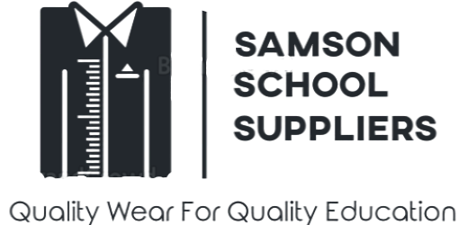

[![Contributors][contributors-shield]][contributors-url]
[![Forks][forks-shield]][forks-url]
[![Stargazers][stars-shield]][stars-url]
[![Issues][issues-shield]][issues-url]
[![LinkedIn][linkedin-shield]][linkedin-url]


<!-- PROJECT LOGO -->
<br />
<p align="center">
  <a href="https://github.com/216022700/Mini-Project-2021">
    
  </a>

  <h3 align="center">Samson School Suppliers</h3>

  <p align="center">
Samson School Suppliers is a web and mobile based school shopping system. It is an online store that allows users to assemble and buy school outfits based on the set of items available (e.g. socks, ties, blazers, etc.).
    <br />
    <a href="https://github.com/216022700/Mini-Project-2021"><strong>Explore the docs »</strong></a>
    <br />
    <br />
    <a href="https://github.com/216022700/Mini-Project-2021">View Demo</a>
    ·
    <a href="https://github.com/216022700/Mini-Project-2021/issues">Report Bug</a>
    ·
    <a href="https://github.com/216022700/Mini-Project-2021/issues">Request Feature</a>
  </p>
</p>


<!-- TABLE OF CONTENTS -->
<details open="open">
  <summary><h2 style="display: inline-block">Table of Contents</h2></summary>
  <ol>
    <li>
      <a href="#about-the-project">About The Project</a>
      <ul>
        <li><a href="#built-with">Built With</a></li>
      </ul>
    </li>
    <li>
      <a href="#getting-started">Getting Started</a>
      <ul>
        <li><a href="#prerequisites">Prerequisites</a></li>
        <li><a href="#installation">Installation</a></li>
      </ul>
    </li>
    <li><a href="#usage">Usage</a></li>
    <li><a href="#roadmap">Roadmap</a></li>
    <li><a href="#contributing">Contributing</a></li>
    <li><a href="#license">License</a></li>
    <li><a href="#contact">Contact</a></li>
    <li><a href="#acknowledgements">Acknowledgements</a></li>
  </ol>
</details>


<!-- ABOUT THE PROJECT -->
## About The Project

[![Product Name Screen Shot][product-screenshot]](https://samsonss.co.za)

The Samson School Suppliers application - Web and Mobile, is an eCommerce website that allows clients to order and purchase schoolwear online. 

The system has the following user structure:
* Administrator - the administrator has the ability to add and manage schools that the company is supplying. They can also manage the items that are available for purchase - add and change item's properties sucha as price per unit and item description. Administrators can also manage the compatibility for each component by assigning it to a school.

* Manager - this user inherits the capabilities of the administrator - they can do everything that the administrator can do. In addition, they can add new stock to the system. The manager can also view the items stock levels and item popularity. 

* Clerk - this user component has the ability to view, fullfil and finalize orders that the clients has placed. During the fullfillment of the order, the clerk is able to adjust the level of a specific item. 

* Client - clients can create an order based on the available items and item compatibility. Once the client is satisfied with their order, they can place the order. The store clerk is then informed of the new order placed by the client.


### Built With

The Samson School Suppliers system was built using the following frameworks: 

* [ASP.NET with C#](https://dotnet.microsoft.com/apps/aspnet)
* [Bootstrap](https://getbootstrap.com)
* [PHP](https://www.php.net/)
* [Android Studio with Java](https://developer.android.com/studio)
* [MySQL using XAMPP](https://www.apachefriends.org/index.html)


<!-- GETTING STARTED -->
## Getting Started

To get a local copy up and running follow these simple steps.

### Prerequisites

The following is a list of things you will need in setting up and running the system. 
* Visual Studio 2019
  ```sh
  download and install Visual Studio from https://visualstudio.microsoft.com/downloads/
  ```
* XAMPP
```sh
download and install XAMPP from https://www.php.net/  
```
* MySQL Connector/NET
```sh
download and install MySQL Connector/NET from https://dev.mysql.com/downloads/connector/net/
```

### Installation

1. Clone the repo
   ```sh
   git clone https://github.com/216022700/Mini-Project-2021.git
   ```
2. Install Visual Studio
   ```sh
   install Visual Studio using the downloaded installer
   ```
3. Install XAMPP
   ```sh
   install XAMPP using the downloaded installer
   ```
4. Install MySQL Connector/NET
  ``` sh
  install MySQL Connector/NET using the downloaded installer
  ```
5. Import MySQL into VS Project
```sh
  in visual studio, right-click on project solution, select add, select reference, search for mysql, select mysql.data, then select ok. 
```  
5. Android
  ```sh
  install the .apk file at /Mini-Project_2021/Android on your phone
  ```


<!-- USAGE EXAMPLES -->
## Usage

Use this space to show useful examples of how a project can be used. Additional screenshots, code examples and demos work well in this space. You may also link to more resources.

_For more examples, please refer to the [Documentation](https://example.com)_


<!-- ROADMAP -->
## Roadmap

See the [open issues](https://github.com/216022700/Mini-Project-2021/issues) for a list of proposed features (and known issues).


<!-- CONTRIBUTING -->
## Contributing

Contributions are what make the open source community such an amazing place to be learn, inspire, and create. Any contributions you make are **greatly appreciated**.

1. Fork the Project
2. Create your Feature Branch (`git checkout -b feature/AmazingFeature`)
3. Commit your Changes (`git commit -m 'Add some AmazingFeature'`)
4. Push to the Branch (`git push origin feature/AmazingFeature`)
5. Open a Pull Request


<!-- LICENSE -->
## License

Distributed under the Samson School Suppliers and UJ License. See `LICENSE` for more information.


<!-- CONTACT -->
## Contact

Siyabonga Banele Magagula - [@exsiyabaneleM](https://twitter.com/exsiyabaneleM) - exsiyabanele@gmail.com

Project Link: [https://github.com/216022700/Mini-Project-2021](https://github.com/216022700/Mini-Project-2021)


<!-- ACKNOWLEDGEMENTS -->
## Acknowledgements

* [Java SE Development Kit 11](https://www.oracle.com/za/java/technologies/javase-jdk11-downloads.html)
* [MySQL Connector/NET](https://dev.mysql.com/downloads/connector/net/)
* [Font Awesome](https://fontawesome.com/)
* [CSS Tutorial](https://www.w3schools.com/css/)
* [HTML Tutorial](https://www.w3schools.com/html/default.asp)
* [SQL Tutorial](https://www.w3schools.com/sql/default.asp)


<!-- MARKDOWN LINKS & IMAGES -->
<!-- https://www.markdownguide.org/basic-syntax/#reference-style-links -->
[contributors-shield]: https://img.shields.io/github/contributors/216022700/repo.svg?style=for-the-badge
[contributors-url]: https://github.com/216022700/repo/graphs/contributors
[forks-shield]: https://img.shields.io/github/forks/216022700/repo.svg?style=for-the-badge
[forks-url]: https://github.com/216022700/repo/network/members
[stars-shield]: https://img.shields.io/github/stars/216022700/repo.svg?style=for-the-badge
[stars-url]: https://github.com/216022700/repo/stargazers
[issues-shield]: https://img.shields.io/github/issues/216022700/repo.svg?style=for-the-badge
[issues-url]: https://github.com/216022700/repo/issues
[license-shield]: https://img.shields.io/github/license/216022700/repo.svg?style=for-the-badge
[license-url]: https://github.com/216022700/repo/blob/master/LICENSE.txt
[linkedin-shield]: https://img.shields.io/badge/-LinkedIn-black.svg?style=for-the-badge&logo=linkedin&colorB=555
[linkedin-url]: https://linkedin.com/in/216022700
[product-screenshot]: images/screenshot.jpg
